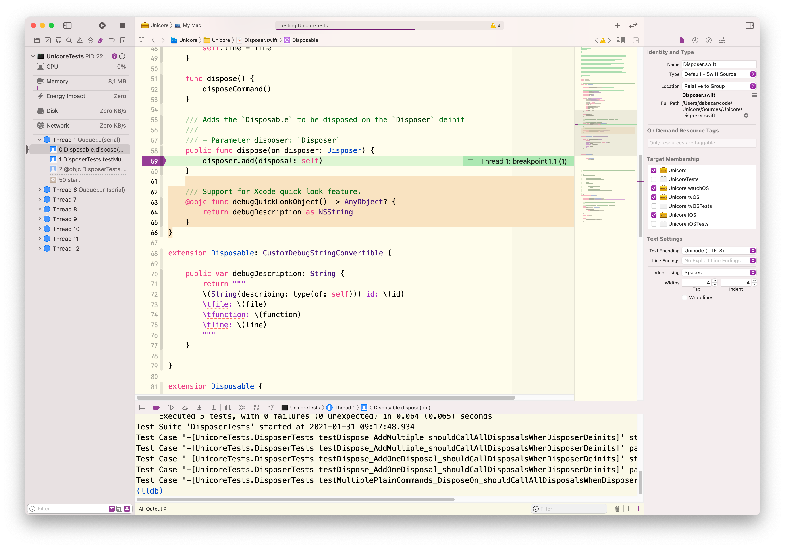
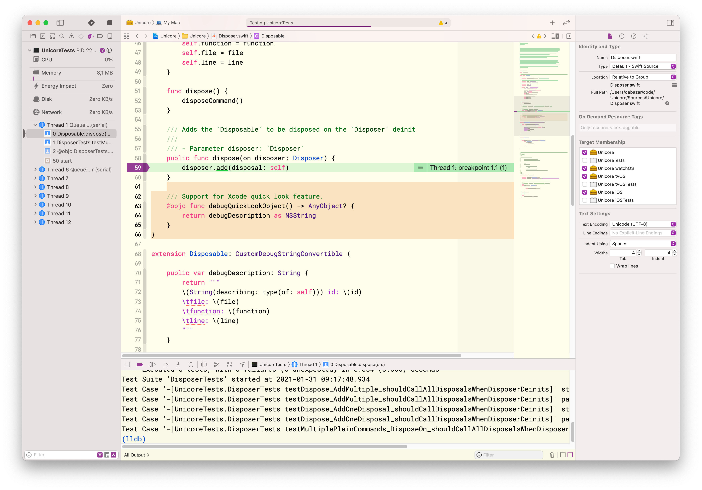

# Bazar Xcode Color theme

Bazar is my personally tailored Xcode color theme.

### Menlo




### Roboto mono



## Setup
```sh
mkdir ~/Library/Developer/Xcode/UserData/FontAndColorThemes/
git clone https://github.com/MaximBazarov/Bazar-Xcode.git
cp Bazar-Xcode/themes/* ~/Library/Developer/Xcode/UserData/FontAndColorThemes/
rm -rf Bazar-Xcode/

```

Then choose one of the `Bazar` color themes in your Xcode.


